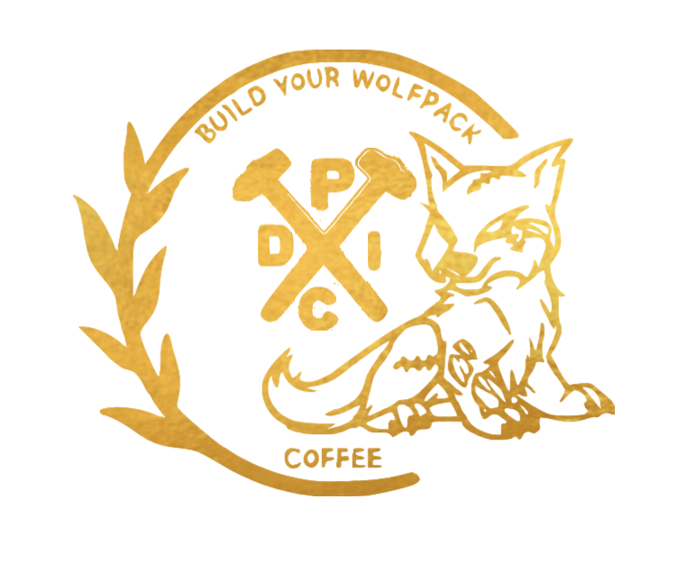
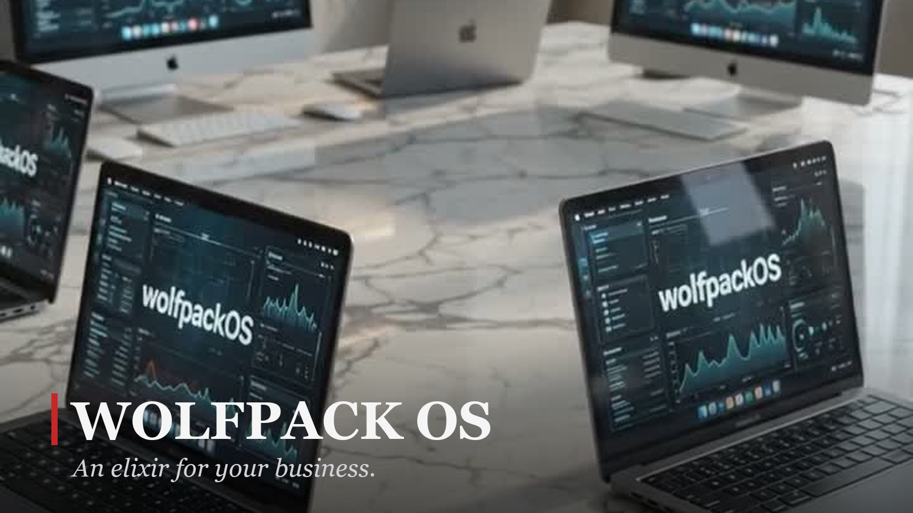

<div align="center">
  
  <h1>Wolfpack OS</h1>
  <p><b>Your own autonomous wolf pack — an elixir for your business.</b><br/>
  A local, agent-driven operating layer that runs your workflows on <b>your</b> machine,
  powered by <b>your</b> Claude Code or Kimi Code subscription.</p>

  <a href="https://buildyourwolfpack.com"></a>
  <a href="https://buildyourwolfpack.com/pages/game"></a>
  <a href="https://www.instagram.com/psychowolfpack1985/"></a>
  <a href="https://www.tiktok.com/@psychowolfpack1985"></a>
  <a href="https://www.youtube.com/@buildyourwolfpack"></a>
  <a href="https://buildyourwolfpack.substack.com"></a>
  <a href="https://x.com/PSYCHOWOLFPACK1"></a>
  <a href="https://discord.gg/s5vr7UtkkB"></a>
  <a href="LICENSE"></a>
  <br/><br/>
  
</div>

---

# Wolfpack OS

Your own autonomous wolf pack — a local, agent-driven operating layer that runs
your business workflows on **your** machine, powered by **your** Claude Code or
Kimi Code subscription. No API keys to buy, nothing leaves your box unless you
say so.

- **The Pack** — pluggable agent personas (CEO, Finance, Marketing, Tech,
  Analytics, BizDev, Events) that take goals, decompose them, and execute
  through skills: browser automation, email, scheduling, research, posting.
- **Dom Copilot** — a local coach for the BuildYourWolfpack game. Rides your
  logged-in session over CDP, nudges you through the 40-step mission, chats
  back in-page, and stores your progress on your machine.
- **Onboarding wizard** — first run asks a few questions (operator, business,
  pack, provider) and generates a working config. Done in minutes.

## Requirements

- macOS or Linux, Python 3.11+
- **One** of: [Claude Code](https://claude.com/claude-code) CLI **or**
  [Kimi Code](https://kimi.com) CLI — installed and signed in. The pack uses
  your subscription; there is no metered API billing.

## Quick start

```bash
git clone <this repo> wolfpack-os && cd wolfpack-os
python3 -m venv .venv && source .venv/bin/activate
pip install -r requirements.txt
cp config/example.yaml config/jarvis.yaml   # or let the wizard write it
python -m jarvis_os --interface gui          # first run opens the onboarding wizard
```

The wizard runs at `http://127.0.0.1:3000` on first boot. Pick your pack, pick
your provider (it detects your installed CLIs), connect what you want — and the
wolfpack starts hunting.

## Dom Copilot (game coach)

```bash
bash scripts/start-chrome-cdp.sh   # log into the game once in this window
python -m jarvis_os.core.copilot_runner --config config/jarvis.yaml
```

## License

Business Source License 1.1 — free for personal and internal business use.
You may not offer Wolfpack OS as a competing hosted or managed service. Each
release converts to Apache 2.0 four years after its release date. See `LICENSE`.
Enterprise support, managed hosting, guided onboarding, and custom builds:
see `ENTERPRISE.md`.
